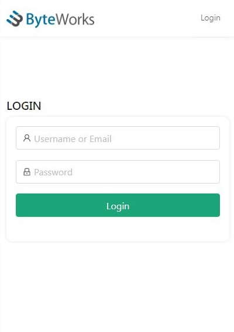

### BW Galaxy™ Task Delivery Management Platform

#### This project is powered with create-react-react from the frontend, and spring boot (java framework) from the backend.

#### MySQL with the help of JPA and Hybernate was used for persisting data,

#### and json web token for authentication.

##### Below you can find the different modules for the app.

-   Login Page: Used by the Admin and the Registered Members.

    

-   Admin Register Member: Used by the Admin to register new members.

    

-   Admin Add New Task: Used by the Admin to add new task

    

-   Admin View All Members: List Registered Members

    

-   Admin View All Tasks: List All Task

    

-   Admin View Completed Task: List All Completed Task

    

-   Admin View Pending Task: List All Pending Task

    

-   Admin Assign Task to Member
    
-   Member Task List: Used to member to view all task assigned to him/her

    

#### For more images, please, checkout the images directory attached to this repository.

### **Instruction on how to use**

    - using MySQL Database, create a database with the name 'bw_galaxy_app'
    - cd into the 'bw-galaxy-frontend' and run this command `npm install` to install dependencies.
    - run `npm start` to start the frontend application on [http://localhost:3000]
    - to start the backend service, I recommend using JetBrains IntelliJ (That's what I used for Development), open the project and start the application.
    - I changed the port to 5000 because Apache was using port 8080 on my system, but you don't have to bother about that because I configured the frontend to be in sync with the backend.
    - an admin account will be automatically created with the 'username' of 'superadmin' and 'password' of 'admin@12' for testing purposes.

#### Hosted on free heroku account [https://yhy-galaxy-view.herokuapp.com/](https://yhy-galaxy-view.herokuapp.com/)

#### thou some functionalities are missing because I used a free version of

#### postgresql and not a paid version of mysql. (Refresh if error).

#### "Thinking in Java" few exercises are also available in this repo.

### Thank you.
